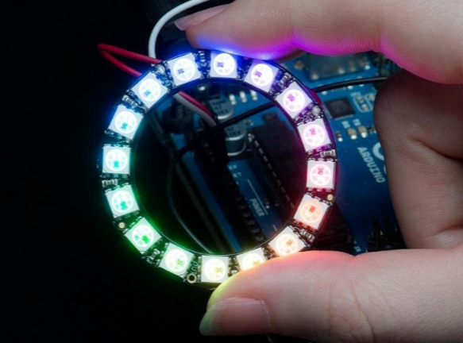
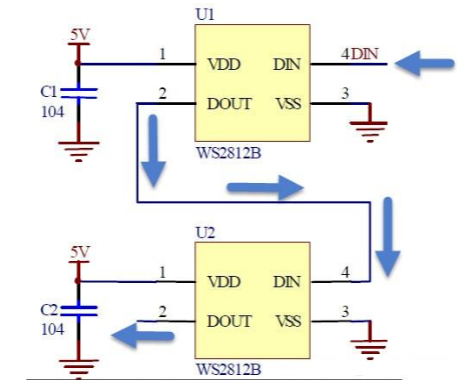

# NeoPixel
 ## Definición
 Los NeoPixel fueron popularizados por la empresa Adafruit, son diodos LED con un microcontrolador  integrado  basados  en  la  norma  WS2812. Permiten conectarse en cascada, utilizando un protocolo de tipo “one wire”, y ser  fácilmente  comandados  por  un  microcontrolador  como  ser Arduino. De  esta manera, y  al estar conectados uno consiguientemente del otro,  cada uno de ellos tendrá un número de orden, correspondiente  a su ubicación dentro de la cadena.
 

 Los leds Neopixeltiene  muchas  ventajas  en  comparación  a  los  leds  tradicionales.  Por  una parte,  permite  al  microcontrolador,  comandar  a  toda  la  cadena  de  leds  utilizando  un  solo cable  de  datos,  lo  cual,  sumando  a  los  dos  de  alimentación,  hace  un  total  de  3  cables  para comandar  una  cantidad  de  leds  virtualmente  ilimitada,  restringida  únicamente  por  la  fuente de alimentación. Adicionalmente, el hecho de que cada led tenga un chip controlador incluido permite que la información de estado enviada por el microcontrolador(color e intensidad) se mantenga  hasta  que  arribe  una  nueva  orden  al  led  en  cuestión.  Esto  trae  aparejado  el beneficio de disminuir la cantidad de procesamiento realizado por el procesador, ya que con las viejas tecnologías éste debía estar actualizando constantemente el estado e intensidad de cada uno de los leds.
 
 
 
 Para  poder  controlar  estos  leds  desde Arduino,  pueden  utilizarse  dos  librerías: Adafruit Neopixel o FastLed. Si bien, con ambas se pueden realizar las mismas tareas, como ser, prender un led en particular, de un determinado color y con  una  intensidad  en  especial;  cada una lo  implementa  de  forma  totalmente  diferente. Como se puede encontrar en infinidad de blogsdedicados a estudiar y solventar dudas sobre estos  tipos  de  leds,  como  por  ejemplo  el  blog  de Dave(Parts  Not  Included)  en  su  post “FastLED  vs.Adafruit_NeoPixel”  menciona  las  diferencias  entre ambos, caracterizando al FastLedcomo mejor implementación que su contraparte.Asimismo, Mark Kriegsman. en su perfil de Google+ demuestra cómo realizar la misma animación con cada una de las librerías, dejando en claro, que la FastLedes ampliamente superior no sólo en cuanto a sencillez de codificación sino también a la cantidad de información que debe enviar cada una para llevar a cabo dicha animación.
